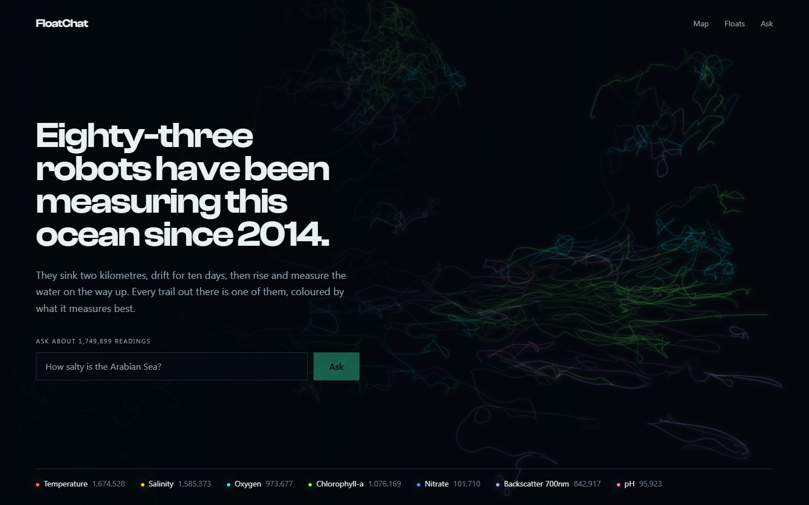
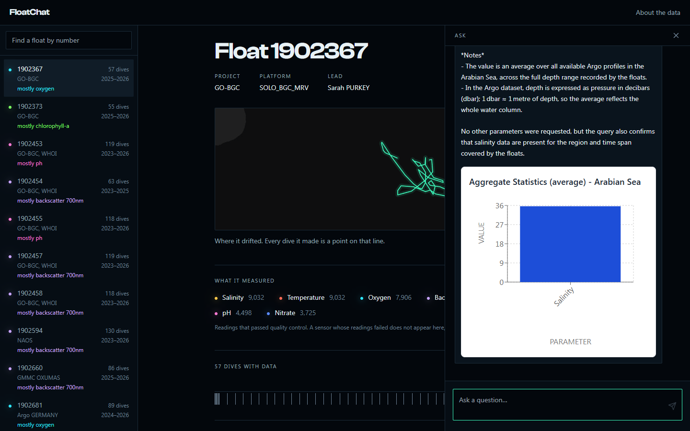
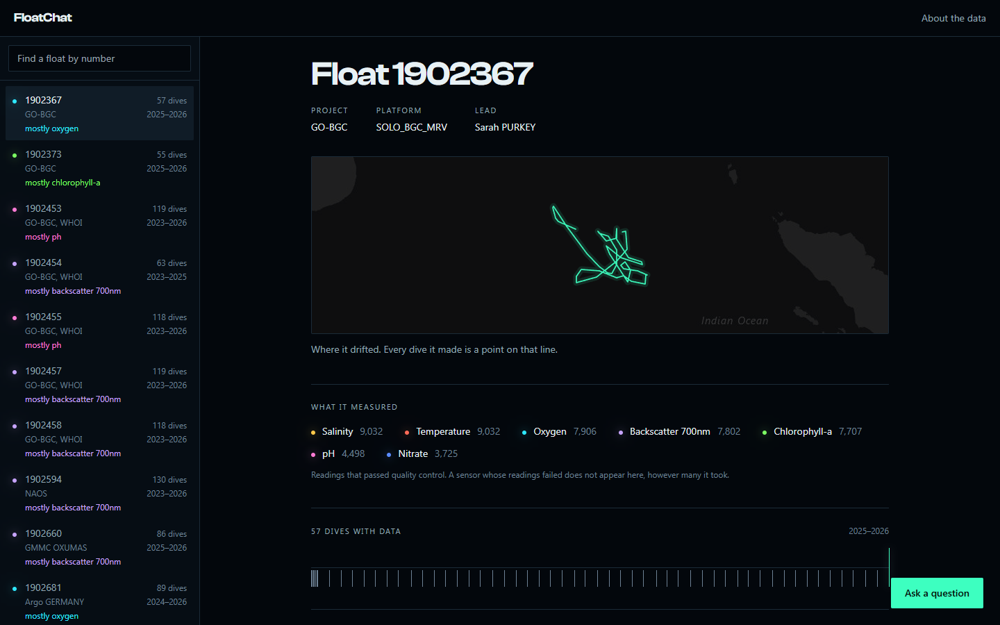

# FloatChat

**[floatchat-live.vercel.app](https://floatchat-live.vercel.app)**

Eighty-three robotic floats have been drifting around the northern Indian Ocean since
2014, sinking to two kilometres and rising every ten days to measure the water on the way
up. This puts everything they recorded on a map, on a page per float, and behind a box you
can type a question into.



The data is from Argo, an international programme that publishes its measurements free.
Getting it into a state where you can query it is most of the work, and that part is
described below.

## Asking it something

The chat runs on a language model, but the model never writes SQL. It picks one of four
declared operations and fills in typed arguments: a region, a date range, a depth band.
The query itself comes from a template in
[`sql_engine.py`](backend/agentic_ai/sql_engine.py) with those values bound.

Ask about the Pacific and it tells you there is no data there. That sounds obvious, but the
first version did the opposite. When the region lookup missed, it quietly dropped the
spatial filter and answered from the whole database, so a question about the North Pacific
came back with the average of 79,470 Indian Ocean measurements and no warning anywhere. A
language model handed those rows writes a confident, fluent, wrong answer. That failure is
why the query layer works the way it does, and the region list is now an enum the API
rejects before the call is even returned.



## Quality control, which is the actual problem

Argo publishes every measurement twice: the raw reading, and an adjusted one that has been
through calibration. Both carry a quality flag, and the two can disagree inside a single
dive, because the calibration state is per sensor rather than per profile.

The obvious rule is to take the adjusted values wherever the flag is good. I tried that
first, on float 2902306, and got zero oxygen, zero nitrate, zero pH, zero backscatter. The
readings are there: 4,604 oxygen values, 73,147 pH values. Every one is flagged 3,
"probably bad", because those sensors are still in real time mode waiting for delayed mode
calibration.

Had I trusted the sensor list and shipped, the database would have had empty columns for
four of the seven measurements, and it would have looked like a bug in my code. So the rule
is per parameter: the adjusted value where it passes, the raw value where it passes,
nothing otherwise. Coverage is then measured per float during ingest and stored, rather
than inferred from what instruments are aboard. Three of the 83 floats end up with no
usable biogeochemistry, and the interface says which ones and why instead of drawing an
empty chart.

## Reading one float

Pick a float and you get its whole record on one page: where it drifted over twelve years,
what it measured, every dive it made on a timeline, and the numbers from whichever dive you
choose.



Colour means something here. Each float is drawn in the colour of the measurement it holds
the most of, using the emission peaks of real bioluminescent organisms, roughly 460 to
700 nm. Floats whose sensors failed quality control have no colour at all, so the dark
paths on the landing page are the gaps in the record. Data marks glow; text never does,
which keeps every string readable.

## What is in it

| | |
|---|---|
| Floats | 83 |
| Dives | 13,026 |
| Measurements | 1,749,899 |
| Period | March 2014 to September 2026 |
| Area | 10°S to 26°N, 40°E to 100°E |
| Measured | temperature, salinity, dissolved oxygen, chlorophyll, nitrate, particle backscatter, pH |

There is no data for any other ocean. No Pacific, no Atlantic, no Mediterranean, no
Southern Ocean.

Two things to know before reading a number off a chart. Profiles are averaged onto standard
pressure levels during ingest, 5 dbar down to 200 m and coarser below, so a stored value is
the mean of the readings inside that level rather than a raw reading. And nitrate comes
back with about a seventh as many values as the other measurements, which is the sensor's
sampling rate rather than a fault.

## Running it

Python 3.12 and Node 20.

```bash
pip install -r backend/requirements.txt
python -m uvicorn backend.main:app --reload

cd frontend && npm install && npm run dev
```

That is the whole setup. The repository carries a small SQLite database of 8 floats, so the
map, the float pages and the charts work with no database to provision and no keys. Only
the chat needs a key: copy `.env.example` to `.env` and add a
[Groq](https://console.groq.com/keys) one.

### Rebuilding the database

```bash
pip install -r requirements-ingest.txt

python ingest.py --self-check           # assertions on the QC rule and the binning
python ingest.py --demo                 # 8 floats  -> data/argo_demo.sqlite
python ingest.py --dsn <postgres-url>   # all 83    -> Postgres
```

`ingest.py` reads the Argo GDAC's synthetic profile index, picks the floats inside a
bounding box, downloads one metadata file and one profile file each, applies the quality
control above, averages onto standard levels, and loads Postgres or SQLite. Downloads are
cached under `.argo-cache/`, so a second run costs nothing. The full 83 float load takes
about six minutes.

Every build drops and recreates the schema, so `--demo` always writes the local file and
never inherits `DATABASE_URL`, and rebuilding a populated non-SQLite database needs
`--replace`.

Load through the direct database endpoint rather than a pooled one. A pooled connection
does not pipeline, and the same load measured 673 rows per second through it against 1,468
direct. Keep the pooled endpoint for the deployed API, which is what it is for.

A full build also rewrites `frontend/src/data/tracks.json`, which is what the landing page
draws and counts. That is deliberate: the front page cannot claim more floats than the
database behind it holds. `--tracks-only` regenerates that file alone.

### One more check

```bash
python check_parameters.py
```

The chat labels a result with the word the question used, so an answer about chlorophyll
comes back as `Chlorophyll` where the interface calls that column `chla`. That mapping lives
in two files in two languages, and when it has drifted the result was never an error: the
chart just lost its unit, or the parameter could not be plotted at all. This reads both files
and fails if a word the API can emit stops resolving.

## Deploying

The API is a [Render](https://render.com) blueprint (`render.yaml`), the interface is a
static Vite build on [Vercel](https://vercel.com) (`frontend/vercel.json`), and the database
is Postgres on [Neon](https://neon.com), where the full set sits at roughly 210 MB inside
the free 0.5 GB.

| Where | Variable | |
|---|---|---|
| Render | `DATABASE_URL` | Postgres connection string |
| Render | `GROQ_API_KEY` | for the chat |
| Render | `CORS_ORIGINS` | the deployed frontend's origin |
| Vercel | `VITE_API_URL` | the deployed API's origin |

The API sleeps after fifteen idle minutes and is not kept awake, because one Render
workspace gets 750 free instance hours a month across every service and going over suspends
all of them. Waking takes about half a minute, and the platform answers with a gateway
error while it boots rather than holding the connection open, so reads retry through it on
a backoff. The landing page needs no API at all, which means it paints immediately and the
container starts waking while you read it.

The chat endpoint is rate limited to 20 questions per five minutes per address, since it is
public and every call spends an API key.

## Data

Collected by the international Argo programme and made freely available by the Coriolis
Global Data Assembly Centre. Argo is part of the Global Ocean Observing System.

## Where this came from

It started as an internal university hackathon project built with Mohammed Lokhandwala and
the team, where it came second. The natural language query layer dates from then.

Everything after that is a rebuild: the ingestion pipeline and its quality control rules,
the move to Postgres, the interface, and the deployment. Along the way the query layer
turned out to answer questions about the Pacific using Indian Ocean measurements, the
standard deviation branch had never once executed on any input, and every depth chart was
drawing a flat line across the top of its frame.
