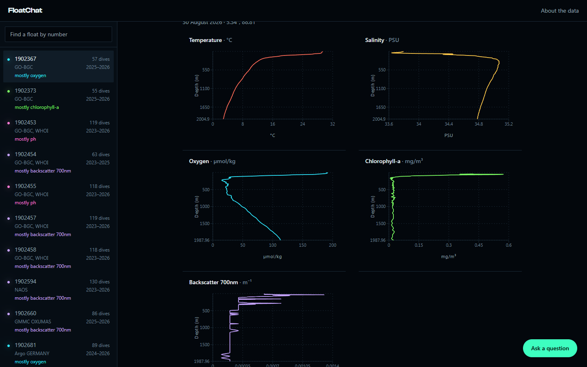

# FloatChat

Ask a question in plain English about 1.75 million quality-controlled ocean measurements
and get the answer with the chart behind it.

The data comes from Argo — a global array of robotic floats that drift with the currents,
sink to two kilometres, and rise every ten days measuring the water on the way up. This
covers 83 biogeochemical floats in the northern Indian Ocean, from 2014 to 2026.


---

## What is actually interesting here

**The language model never writes SQL.** It chooses one of four declared functions and
supplies typed arguments — a region, a date range, a depth band — and every statement
that reaches the database is assembled from a template in
[`backend/agentic_ai/sql_engine.py`](backend/agentic_ai/sql_engine.py) with those values
bound rather than interpolated.

A question about the Pacific raises `UnsupportedRegion` and says there is no data, instead
of silently dropping the spatial filter and answering with the wrong ocean. That failure
mode — a confident wrong answer rather than a crash — is the reason the query layer works
this way.

**Getting usable data out of Argo is most of the engineering.** Every parameter is
published twice, raw and calibrated, each with its own quality flag, and the two can
disagree inside a single dive. `ingest.py` resolves that per parameter: the adjusted value
where it passes QC, the raw value where it does not, and nothing that is not flagged 1 or
2.

That rule matters more than it sounds. Float 2902306 carries oxygen, nitrate, pH and
backscatter sensors, and reports 4,604 finite oxygen values and 73,147 finite pH values —
every one of them flagged "probably bad" because the sensors are still in real-time mode.
A naive "use the adjusted values" pipeline ships a database whose biogeochemistry columns
are silently empty. Three of the 83 floats are in this state, and the interface says so
rather than offering an empty chart.

---

## The interface

One screen: a float chooser, and either the whole ocean or one float read top to bottom.


Colour carries meaning rather than decoration. Each float is drawn in the colour of the
measurement it holds the most of, using the emission peaks of real bioluminescent marine
organisms; floats whose sensors failed quality control have no colour at all. Data marks
emit light, text never does, which keeps every string at full contrast.



---

## What is in the database, and what is not

|  |  |
|---|---|
| Floats | 83 |
| Dives | 13,026 |
| Measurements | 1,749,899 |
| Period | March 2014 – September 2026 |
| Area | 10°S–26°N, 40°E–100°E |
| Parameters | temperature, salinity, dissolved oxygen, chlorophyll, nitrate, particle backscatter, pH |

There is **no data for any other ocean**. No Pacific, no Atlantic, no Mediterranean, no
Southern Ocean.

Two things worth knowing before reading a number:

- **Profiles are binned onto standard pressure levels** at ingest — 5 dbar to 200 m, 10 to
  1000, 25 to 2000. A stored value is the mean of the readings within that level, not a
  raw reading. `ingest.py --resolution raw` builds the full-resolution database instead.
- **Nitrate returns roughly a seventh as many values** as the other parameters. That is the
  sensor's lower vertical sampling rate, not a defect.

---

## Running it

Requires Python 3.12+ and Node 20+.

```bash
# API — serves the 8-float database committed under data/
pip install -r backend/requirements.txt
python -m uvicorn backend.main:app --reload

# Interface
cd frontend && npm install && npm run dev
```

That is the whole setup. No database to provision, no keys: the map, the float dossiers
and the charts all work against the committed SQLite. Only the chat needs a key —
copy `.env.example` to `.env` and add a [Groq](https://console.groq.com/keys) one.

### Rebuilding the database from source

```bash
pip install -r requirements-ingest.txt

python ingest.py --self-check        # assertions on the QC rule and the binning
python ingest.py --demo              # 8 floats  -> data/argo_demo.sqlite
python ingest.py --dsn <postgres-url>   # all 83  -> Postgres
```

Every build drops and recreates the schema. `--demo` therefore always writes the local
file and never inherits `DATABASE_URL`, and rebuilding a non-SQLite database that already
holds measurements requires `--replace`.

`ingest.py` reads the Argo GDAC's synthetic-profile index, selects floats inside a
bounding box, downloads one `_meta.nc` and one `_Sprof.nc` per float, applies the quality
control above, bins the profiles, and writes to Postgres or SQLite. Downloads are cached
under `.argo-cache/`, so a second run costs nothing.

A full build also rewrites `frontend/src/data/tracks.json`, which is what the landing page
draws and counts. That is deliberate: the marketing surface cannot claim more floats than
the database it sits in front of. `--demo` skips it, so a local convenience build cannot
cut the published page down to eight floats. `--tracks-only` regenerates it alone.

---

## Deploying

The API is a [Render](https://render.com) blueprint (`render.yaml`); the interface is a
static Vite build on [Vercel](https://vercel.com) (`frontend/vercel.json`). The database is
Postgres — [Neon](https://neon.com)'s free tier fits the full 83-float set at roughly
210 MB.

| Where | Variable | |
|---|---|---|
| Render | `DATABASE_URL` | Postgres connection string |
| Render | `GROQ_API_KEY` | for the chat |
| Render | `CORS_ORIGINS` | the deployed frontend's origin |
| Vercel | `VITE_API_URL` | the deployed API's origin |

The API is not kept awake. One Render workspace has 750 free instance-hours a month across
every service, and exceeding that suspends all of them, so a first request after an idle
spell waits through a cold start of roughly half a minute. The interface says so rather
than showing a spinner that looks broken.

The chat endpoint is rate limited per client address, because it is public and every call
spends a paid API key.

---

## Data

Collected by the international Argo programme and made freely available by the Coriolis
Global Data Assembly Centre. Argo is part of the Global Ocean Observing System.

---

## Origin

This began as an internal university hackathon project built with Mohammed Lokhandwala and
the team, where it placed second. The natural-language query layer dates from then.

Everything since is a rebuild: the ingestion pipeline and its quality-control rules, the
move to Postgres, the interface, the deployment, and the corrections along the way — the
query layer used to answer questions about the Pacific with Indian Ocean measurements, and
the standard-deviation branch had never once executed.
